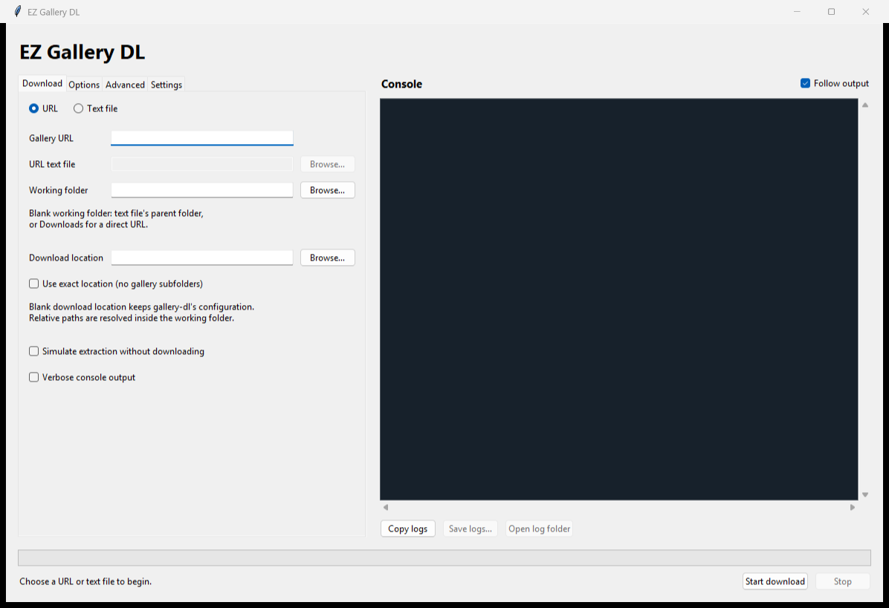

# EZ Gallery DL

A Windows Tkinter application for running gallery-dl sequentially against one URL or a UTF-8 text file containing one URL per line. Blank lines are ignored, whitespace is trimmed, and order and duplicate URLs are preserved.

## Setup and launch

Requires PowerShell 7 and [uv](https://docs.astral.sh/uv/).

```powershell
./setup.ps1
./launch.ps1
```

Setup creates a local Python 3.12 environment, installs gallery-dl, and creates `EZ Gallery DL.lnk` in the application folder. Double-click that shortcut for subsequent launches. The UI uses the Python standard library; no AI, GPU, or image-processing packages are installed.

For a terminal launch with Python tracebacks visible:

```powershell
uv run python -m app
```



## Downloads

- Choose URL or Text file, enter the source, and click Start download.
- A blank working folder uses the text file's parent directory, matching the PowerShell script. Direct URLs use your Downloads folder. An explicit working folder must exist.
- Download location maps to `--destination`. Exact location maps to `--directory`. Leaving it blank preserves gallery-dl's own directory configuration.
- Options include a gallery-dl config file, cookies file or browser/profile, download archive, filename format, rate limit, sleep, file range, metadata, tags, simulation, and verbose output.
- Advanced arguments use one argument per line: put an option and its value on separate lines, without shell quotes. Relative paths resolve against the working folder. Arguments are passed directly, without a shell.
- Settings can select an existing gallery-dl executable; blank uses the copy installed in this app's environment.
- Each URL runs in a separate process. Progress counts completed galleries, not individual files. A nonzero exit stops the queue and surfaces the process failure. Stop terminates the current gallery-dl process and cancels the remaining queue.

## Console and configuration

The console streams combined stdout/stderr and supports scrolling, follow output, copy, save, and opening the log folder. Full logs are retained even when older lines leave the visible console. Logs contain CLI arguments and output.

`%LOCALAPPDATA%\EZ-Gallery-DL\config.json` stores saved defaults. `state.json` restores the last session, window size, and divider. The Settings tab can save and load defaults. Logs live in the adjacent `logs` folder. gallery-dl's own configuration remains separate and follows its normal loading rules.

CLI reference: [gallery-dl options](https://github.com/mikf/gallery-dl/blob/master/docs/options.md).
